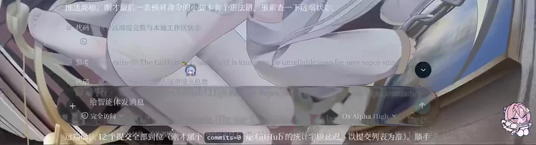
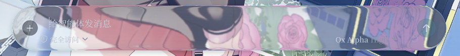
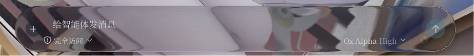

# dsh-liquid-glass-input

给 DSH Web GUI 输入卡加 kube.io「Magnifying Glass」液态玻璃折射效果：

- 官方位移图/高光图/放大图，端头等比缩放贴合四角，中段平铺补线；Canvas 预合成，滤镜内约 11 原语
- 按压动画：原版 9 弹簧系统逐参数复刻（rAF 积分，transform/阴影/滤镜 scale 全耦合）
- 点击处柔和高光（设置里可关）、动画速度滑杆（设置里可调）
- 仅 Chromium 系浏览器可见折射

## 效果预览



| 浅色模式效果 | 暗色模式效果 |
| --- | --- |
|  |  |

> 折射效果仅 Chromium 系浏览器可见；动图为录屏压缩版，实际效果以实机为准。

## 这不是一层模糊：四个效果层

市面上多数「液态玻璃」皮肤只有一行 `backdrop-filter: blur()`——背景透过卡片只是被磨糊，边缘没有任何光学变化，本质是亚克力磨砂。本插件用的是 [kube.io](https://kube.io/blog/liquid-glass-css-svg) 的 SVG 位移图折射方案，玻璃由三层光学层加一层可选磨砂组成，每层都能在设置里单独开关、调强度、一键恢复默认：

| 层 | 做什么 | 对应物理现象 |
| --- | --- | --- |
| 放大层 | 背景经放大图采样，卡片内侧呈现凸透镜式的近边放大 | 透镜放大 |
| 折射层 | 官方位移图按法线偏移重采样背景，图像在卡片边缘处弯折、收缩 | 斯涅尔折射 |
| 高光层 | 由位移图的斜率场生成随视角流动的边缘高光与色散感 | 菲涅尔反射 |
| 磨砂层 | 传统的高斯模糊底子，托住上面三层，强度可调 | 毛玻璃散射 |

简单说：普通亚克力是把背景「糊掉」，这里是让背景「穿过」一块有厚度的玻璃——边缘的直线会被掰弯，四角的图案会被放大，光会沿着棱线流动。这也是为什么它只在 Chromium 系浏览器生效：位移图折射依赖 SVG `feDisplacementMap` 滤镜。

性能上，三张映射图经 Canvas 预合成为滤镜源，整个效果控制在单个 SVG 滤镜内约 11 个原语；按压动画为原版同款 9 弹簧系统逐参数复刻（rAF 积分），transform、阴影、滤镜缩放全耦合。

## 安装

```
dsh plugin add github:jkamkk/dsh-liquid-glass-input
```

本地开发调试可从目录安装：

```
dsh plugin --profile web add <本目录>
```

安装后重启 DSH Web GUI 生效。

位移图来源：https://kube.io/blog/liquid-glass-css-svg （版权归原作者，仅限个人学习使用）
